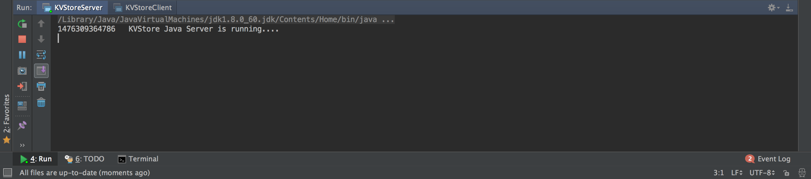
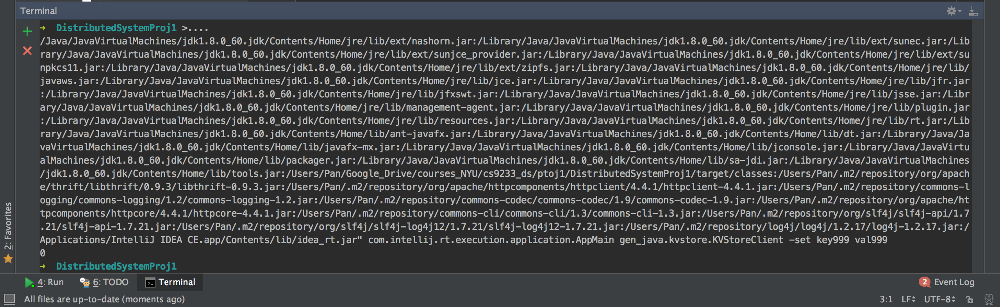
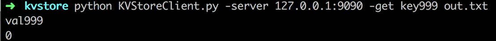

# Project1-kvstore-thrift

Compilers:
- Java 8
- Python 2.7

Run Instructions:
1. start a new IntelliJ Maven project
2. add libraries as Maven dependencies, mainly those two:
```
<dependency>
    <groupId>org.apache.thrift</groupId>
    <artifactId>libthrift</artifactId>
    <version>0.9.3</version>
</dependency>
<dependency>
    <groupId>commons-cli</groupId>
    <artifactId>commons-cli</artifactId>
    <version>1.3</version>
</dependency>
```
3. add kvstore.thrift file to /PROJ_ROOT_PATH/src/main/java/
4. generate Thrift files
```
thrift -r --gen java kvstore.thrift
thrift -r --gen py kvstore.thrift
```
rename folder "gen-java" to "gen_java" then change all java files' package path like "package gen_java.kvstore;"
5. add *.java to /PROJ_ROOT_PATH/src/main/java/gen_java/kvstore/
6. start server in IntelliJ
7. test Java client and Python client as
```
java PARAMETERS gen_java.kvstore.KVStoreClient -server 127.0.0.1:9090 -set key999 val999
java PARAMETERS gen_java.kvstore.KVStoreClient -server 127.0.0.1:9090 -get key999 out.txt
java PARAMETERS gen_java.kvstore.KVStoreClient -server 127.0.0.1:9090 -del key999
```
```
python KVStoreClient.py -server 127.0.0.1:9090 -set key999 val999
python KVStoreClient.py -server 127.0.0.1:9090 -get key999 out.txt
python KVStoreClient.py -server 127.0.0.1:9090 -del key999
```
*when testing Java client, copy the detailed parameters inluding class path in IntelliJ to terminal to replace the "PARAMETERS" then test following the usage

*key-value db is implemented as a HashMap as <String, String>, e.g. ("key1": "value1").






